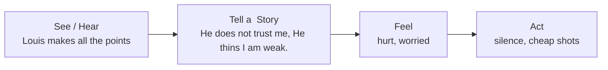

# Crucial Conversation

> [!NOTE]
>
> This note is not done

## Why we care

> A discussion between two or more people where (1) stakes are high, (2) opinion vary, (3) emotions run strong.

> Throughout the book, there are many example dialogues, as much as I want to shorten this notes down to essence, I felt these dialogues are too important to be skipped. Let's learn by example.

Consider conversations might have happened in our day-to-day life:

- In the middle of a casual conversation with your spouse, he or she brings up an "ugly incident" took place in yesterday's neighbourhood block party. Apparently not did you only flirt with someone at the party, but according to your spouse, "you were clearly making out". You do not remember flirting, you recall only being polite and friendly. Your spouse walks off in a huff.
- Your spouse has been paying less and less attention to you. You realize he or she has a busy job, but you still would like more time together. You drop a few hints about the issue, but your loved one doesn't handle it well. You decide not to put on added pressure, so you clam up. Of course, since you're not all that happy with the arrangement, your dis pleasure now comes out through an occasional sarcastic remark. "Another late night, huh? Do you really need all of the money in the world?" 
- Your roommate Terry who wears your and your other two roommates' clothes (without asking)-and he's proud of it. In fact, one day while walking out the door, he glibly announced that he was wearing something from each of your closets. You could see Taylor's pants, Scott's shirt, and, yes, even Chris's new matching shoes-and-socks ensemble. What of yours could he possibly be wearing? Eww! Your response, quite naturally, has been to bad-mouth Terry behind his back. That is until one day when he overheard you belittling him to a friend, and you're now so embarrassed that you avoid being around him. Now when you're out of the apartment, he wears your clothes, eats your food, and uses your computer out of spite.

And many more:

- Asking a friend to repay a loan
- Giving the boss feedback about her behavior
- Approaching a boss who is breaking his own safety or quality policies
- Asking a roommate to move out
- Discussing problems with sexual intimacy 
- Talking to a coworker about a personal hygiene problem

In such conversation, when things are heating up, you can do one of three things:

- Avoid or ignore them, and suffer the consequences.
- Face and handle them poorly.
- Face and handle them well.

Apparently you want to face and handle them well, but more likely to happen is, you don't act rationally at your best intention.

- ***We are not designed well*** Our body diverts blood from brain to muscle around the body to prepare for nonessential tasks such as hitting and running.
- ***We are under pressure*** Stakes are high, we might be multitasking and not well-prepared.
- ***We are stumped*** An important question got thrown out, we are not ready to make a hard stop to think about it, and we make cheap shots without thinking.

It has been observed that results of such heated conversations often fall into three categories:

- Digress into threats and name-calling.
- Revert to silent and silent fuming.
- Speak openly, honestly, and effectively.

Two scholars, Clifford Notarius and Howard Markman, observed couples who engaged in heated discussions, they predicted nearly 90% of the divorces that occurred. Over time, people who found a way to state their opinions about high-stakes, controversial, and emotional issues honestly, respectfully remained together. Those who didn't, split up.

Criminals in prison are not always a career criminal, over half of the people who are convicted crimes are first time offenders who commit crimes against their loved ones and friends. They once had a job, paid their bills and remembering friends' birthday, but unresolved problem builds up and then boiled over into acts of hatred.

Research done by Dr. Janice Kiecolt-Glaser and Dr. Ronald Glaser found those who routinely fails their crucial conversations had far weaker immune systems. When facing life-threatening diseases, studies also showed significantly higher recovering rate for people who have effective communication skills.

I hope the above is enough to convince you handling a crucial conversation. Ironically, the more crucial the conversation, the less likely we are able to handle it well. As we step up to a crucial conversation and handle it well, from our careers, relationships, to personal health, can all be benefited. So what can we do about it?

## Start With Heart

### Fill the Share Pool of Meaning

Kevin, his peers, and their boss were deciding on a new location for their offices-would they move across town, across the state, or across the country? The first two execs presented their arguments for their top choices, and as expected, their points were greeted by penetrating questions from the full team. No vague claim went unclarified, no unsupported reasoning unquestioned.

Then Chris, the CEO, pitched his preference-one that was both unpopular and potentially disastrous. However, when peo ple tried to disagree or push back on Chris, he responded poorly. Since he was the big boss, he didn't exactly have to browbeat people to get what he wanted. Instead, he became slightly defensive. First he raised an eyebrow. Then he raised his finger. Finally he raised his voice-just a little. It wasn't long until people stopped questioning him, and Chris's inadequate proposal was quietly accepted.

Well almost. That's when Kevin spoke up. His words were simple enough-something like, "Hey Chris, can I check some thing out with you?" 

The reaction was stunning-everyone in the room stopped breathing. But Kevin ignored the apparent terror of his colleagues and plunged on ahead. In the next few minutes he in essence told the CEO that he appeared to be violating his own decision-making guidelines. He was subtly using his power to move the new offices to his hometown.

Kevin continued to explain what he saw happening, and when he finished the first crucial minutes of this delicate exchange, Chris was quiet for a moment. Then he nodded his head. "You're absolutely right," he finally concluded. "I have been trying to force my opinion on you. Let's back up and try again."

This was a crucial conversation, and Kevin played no games whatsoever. He didn't resort to silence like his colleagues, nor did he try to force his arguments on others. As a result, the team chose a far more reasonable location and Kevin's boss appreciated his candor.

We look at a conversation as a group of sentences, each incrementally adds some meaning to the shared pool, even if it seems controversial. As more accurate information and more ideas are added to the pool, better decision we can make. To do this we need people to speak up, even if the idea is against idea from someone more powerful.

### A Moment of Truth

Greta, the CEO of a mid-sized corporation, is two hours into a rather tense meeting with her top leaders. For the past six months she has been on a personal campaign to reduce costs. Little has been accomplished to date, so Greta calls the meeting. Surely people will tell her why they haven't started cutting costs. After all, she has taken great pains to foster candor. 

Greta has just opened the meeting to questions when a man ager haltingly rises to his feet, fidgets, stares at the floor, and then nervously asks if he can ask a very tough question. The way the fellow emphasizes the word very makes it sound as if he's about to accuse Greta of kidnapping the Lindbergh baby. 

The frightened manager continues. "Greta, you've been at us for six months to find ways to cut costs. I'd be lying if I said that we've given you much more than a lukewarm response. If you don't mind, I'd like to tell you about one thing that's making it tough for us to push for cost cuts." 

"Great. Fire away," Greta says as she smiles in response. "Well, while you've been asking us to use both sides of our paper and forego improvements, you're having a second office built." 

Greta freezes and turns bright red. Everyone looks to see what will happen next. The manager plunges on ahead. "The rumor is that the furniture alone will cost $150,000. Is that right?" 

So there we have it. The conversation has just turned crucial. Someone has just poured a rather ugly tidbit into the pool of meaning. Will Greta continue to encourage honest feedback, or will she shut the fellow down? Let's have a look at four possible responses.

- "Excuse me", she responds, "I don't think that my new office is an appropriate topic for this forum."
- "You're wrong! We're not spending anywhere near a hundred and fifty thousand dollars on the furniture. It's the redesign of the office that's costing so much, not the furniture." 
- "I can't believe that you're accusing me of squandering good money on a perfectly fine office. Now, if nobody else has any intelligent questions, let's move on!"

Bang, Greta is dead, any sentence above cost her buy-in, confirmed all suspicions around honesty.

- Greta did not give in to her raging desire to fight back and defend herself, she took a depth breath, "You know what? We need to talk about this. I'm glad you asked the question. It'll give us a chance to discuss what's really going on.".

    And then Greta went on to explain she felt that an office was necessary but admitted she had no idea what it would cost. So she sent someone to check the numbers. Meanwhile, she explained that that the building was a respond to marketing's advice to boos the company 's image and improve client confidence, it would be primarily a hosting location for marketing. When she saw the figures for new office, she was stunned and admitted she should have checked the costs before signing a work order, then she committed to drawing up a new plan that would cut the cost by half.

At first Greta felt attacked, but she was able keep her composure by asking herself a question --- "What do I *really* want here?", it has a powerful effect and she quickly realize she was here to encourage her managers to embrace to cost-reduction efforts and influence thousands of others to do the same. Therefore, she was able to *refocus her brain* to what she really wants.

### Conclusion

We often shift our focus sub-consciously, from our original goal to strike back or winning an argument. This is because thousands of years of genetic hand-wiring brings our emotion to quick boil, and deeply ingrained with our habit of trying to win. As we grow older we tends to be more fixated, we might starts out with resolving a problem, but as long as someone raise a red flag that challenges your correctness, boom, we change the purpose in a heart beat. We need to take control of our body, start with a question that brings blood back to our brain. Remember, the only one who can control you is yourself.

- "What does my behaviour tell me about what my motives are?" 
- "What do I want for myself? For others? For the relationship?"
- "How would I behave if this were what I really wanted?"

Think about what else you can say, refuse the *Sucker's Choice* where you choose between honest or peace --- there is always a third option, find it! Someone had to speak up, we are so uncomfortable with the immediate conflict that we accept the certainty of bad results to avoid possibility of uncomfortable conversation. We choose peace over conflict, but it is not to our long-term interest. In Greta's case, if nobody raised concern over the new office, Greta would never learned the real issue, and people will continue drag their feet.

## Learn to Look

We should watch the content of the conversation, from a higher perspective, by realizing a conversation turns ugly, you can respond and work our way back to a healthy conversation. You should watch for signals, physical signals like stomach getting tight and eyes get dry; or emotional signals like raising tone of the voice, and speaks faster than they usual do. 

Remember, we need to keep a conversation ***safe***, when a conversation is safe, and people do not act defensively, and you can literally say anything. Do you recall when was the last time you accept a potentially threatening feedback? I guess you must have accepted some of them from your parents or teachers. Why? Because you believe that person had your best interest in mind, they will not say anything unreasonable, they are not your enemy and you feel *safe*. 

On the other hand, if people does not feel safe, even well-intended comments are suspected. You need to ensure people feel safe before putting out your potentially controversial comments. If not, they may start making fun of you so that they feel safer. In this case, you should treat their silence or even attacks as a sign of they are not feeling safe, and respond in kind. This is no easy task and requires conscious training.

### Silence

Silence is an act of withhold information from the pool of meaning, it is almost always a sign of avoiding potential problems, range from playing verbal games to avoiding a person entirely.

- **Masking** Understating or selectively showing our true opinions. Sarcasm, sugarcoating, and couching are some of the more popular forms. 

    - **Say** "I think your idea is, uh, brilliant. Yeah, that's it. I just worry that others won't catch the subtle nuances. Some ideas come before their time, so expect some, uh, minor resistance. "
        **Meaning** Your idea is insane, and people will fight it with their last breath.

    - **Say** "Oh yeah, that'll work like a charm. Offer people a discount, and they'll drive all the way across town just to save six cents on a box of soap. Where do you come up with this stuff?"
        **Meaning** What a dumb idea.

- **Avoiding** Steering completely away from sensitive subjects. We talk, but without addressing the real issues. 

    - **Say** "How does your new suit look? Well, you know that blue's my favourite colour. "
        **Meaning** What happened? Did you buy clothes at the circus?

    - **Say** "Speaking of ideas fo r cost cutting-did you see Friends last night? Joey inherited a bunch of money and was buying stu pid stuff. It was a hoot. "
        **Meaning** Let's not talk about how to cut costs, It always leads to a fight

- **Withdrawing** Pulling out of a conversation altogether. We either exit the conversation or exit the room.

    - **Say** "Excuse me. I've got to take this call. "
        **Meaning** I'd rather gnaw off my own arm than spend one more minute in this useless meeting. 

    - **Say** "Sorry, I'm not going to talk about how to split up the phone bill again. I'm not sure our friendship can stand another bat tle. " (Exits.) 
        **Meaning** We can't talk about even the simplest of topics with out arguing.

### Violence

Violence consists of any verbal strategy that attempts to convince, control, or compel others to your point of view. It violates safety by trying to force meaning into the pool. Methods range from name-calling and monologuing to making threats. The three most common forms are controlling, labeling, and attacking.

- **Controlling** Coercing others to your way of thinking. It's done through either forcing your views on others or domi nating the conversation. Methods include cutting others off, overstating your facts, speaking in absolutes, changing sub jects, or using directive questions to control the conversation.
    - **Say** "There's not a person in the world who hasn't bought one of these things. They're the perfect gift. "
        **Meaning** I can't justify spending our hard-earned savings on this expensive toy, but I really want it.
    - **Say** "We tried their product, but it was an absolute disaster. Every one knows that they can't deliver on time and that they offer the worst customer service on the planet. "
        **Meaning** I'm not certain of the real facts so I'll use hyperbole to get your attention.
- **Labelling** Putting a label on people or ideas so we can dis miss them under a general stereotype or category.
    - **Say** "Your ideas are practically Neanderthal. Any thinking person would follow my plan. "
        **Meaning** I can't argue my case on its merits.
    - **Say** "You're not going to listen to them are you? For crying out loud! First, they're fro m headquarters. Second, they're engineers. Need I say more?"
        **Meaning** If I pretend that all people from headquarters and all engineers are somehow bad and wrong, I won't have to explain anything.
- **Attacking** You've moved from winning the argument to making the person suffer.
    - **Say** "Try that stupid little stunt and see what happens."
        **Meaning** I will get my way on this even if I have to bad-mouth you and threaten some vague punishment.
    - **Say** "Don't listen to a word Jim is saying. I'm sorry Jim, but I'm on to you. You're just trying to make it better for your team while making the rest of us suffer. I've seen you do it before. Yo u're a real jerk, you know that? I'm sorry, but someone has to have the guts to tell it like it is. "
        **Meaning** To get my way I'll say bad things about you and then pretend that I'm the only one with any integrity.

### Style Under Stress

Self monitoring is hard, we speak when we shouldn't and we do things we don't intend to. We often make a judgement without going through in-depth thinking and words split out after a thought flashes.

- "People were always talking about how mean this guy was who lived on our block. But I decided to go see for myself. I went to his door, but he said he wasn't the mean guy, the mean guy lived in that house over there. 'No, you stupid idiot,' I said, 'that's my house. "
- You're talking to your spouse about the fact that he or she left you sitting at the auto repair shop for over an hour. After pointing out that it was a simple misunderstanding, your spouse exclaims: "You don't have to get angry." Then you utter those famous words: "I'm not angry!"
- "What's wrong?", "Nothing's wrong," you whimper. Then you shuffle your feet, stare at the floor, and look wounded.

To break from this insidious cycle, we need to be able to identify ourselves

- Learn to look at content and conditions.
- Look for when things become crucial.
- Learn to watch for safety problems.
- Look to see if others are moving toward silence or violence.
- Look for outbreaks of your Style Under Stress (see below).

What kind of self monitoring you are? Here is a set of question for you to answer

| No   | Question                                                     | T/F  |
| ---- | ------------------------------------------------------------ | ---- |
| 1    | At times I avoid situations that might bring me into contact with people I'm having problems with. | T    |
| 2    | I have put off returning phone calls or emails because I simply didn't want to deal with the person who sent them. | F    |
| 3    | Sometimes when people bring up a touchy or awkward issue, I try to change the subject. | F    |
| 4    | When it comes to dealing with awkward or stressful subjects, sometimes I hold back rather than give my full and candid opinion. | T    |
| 5    | Rather than tell people exactly what I think, sometimes I rely on jokes, sarcasm, or snide remarks to let them know I'm frustrated. | T    |
| 6    | When I've got something tough to bring up, sometimes I offer weak or insincere compliments to soften the blow. | T    |
| 7    | In order to get my point across, I sometimes exaggerate my side of the argument. | T    |
| 8    | If I seem to be losing control of a conversation, I might cut people off or change the subject in order to bring it back to where I think it should be. | T    |
| 9    | When others make points that seem stupid to me, I sometimes let them know it without holding back at all. | T    |
| 10   | When I'm stunned by a comment, sometimes I say things that others might take as forceful or attacking-comments such as "Give me a break!" or "That's ridiculous!" | T    |
| 11   | Sometimes when things get heated, I move from arguing against others' points to saying things that might hurt them personally. | F    |
| 12   | If I get into a heated discussion, I've been known to be tough on the other person. In fact, the person might feel a bit insulted or hurt. | T    |
| 13   | When I'm discussing an important topic with others, sometimes I move from trying to make my point to trying to win the battle. | F    |
| 14   | In the middle of a tough conversation, I often get so caught up in arguments that I don't see how I'm coming across to others. | T    |
| 15   | When talking gets tough and I do something hurtful, I'm quick to apologize for mistakes. | T    |
| 16   | When I think about a conversation that took a bad tum, I tend to focus first on what I did that was wrong rather than focus on others' mistakes. | T    |
| 17   | When I've got something to say that others might not want to hear, I avoid starting out with tough conclusions, and instead start with facts that help them understand where I'm coming from. | T    |
| 18   | I can tell very quickly when others are holding back or feeling defensive in a conversation. | T    |
| 19   | Sometimes I decide that it's better not to give harsh feedback because I know that it's bound to cause real problems. | T    |
| 20   | When conversations aren't working, I step back from the fray, think about what's happening, and take steps to make it better. | T    |
| 21   | When others get defensive because they misunderstand me, I quickly get us back on track by clarifying what I do and don't mean. | T    |
| 22   | There are some people I'm rough on because, to be honest, they need or deserve what I give them. | T    |
| 23   | I sometimes make absolute statements like "The fact is . . . " or "It's obvious that . . . " to be sure I get my point across. | T    |
| 24   | If others hesitate to share their views, I sincerely invite them to say what's on their mind, no matter what it is. | F    |
| 25   | At times I argue hard for my view-hoping to keep others from bringing up opinions that would be a waste of energy to discuss. | F    |
| 26   | Even when things get tense, I adapt quickly to how others are responding to me and try a new strategy. | F    |
| 27   | When I find that I'm at cross-purposes with someone, I often keep trying to win my way rather than looking for common ground. | F    |
| 28   | When things don't go well, I'm more inclined to see the mistakes others made than notice my own role. | F    |
| 29   | After I share strong opinions, I go out of my way to invite others to share their views, particularly opposing ones | T    |
| 30   | When others hesitate to share their views, I do whatever I can to make it safe for them to speak honestly. | F    |
| 31   | Sometimes I have to discuss things I thought had been settled because I don't keep track of what was discussed before. | T    |
| 32   | I find myself in situations where people get their feelings hurt because they thought they would have more of a say in final decisions than they end up having. | F    |
| 33   | I get frustrated sometimes at how long it takes some groups to make decisions because too many people are involved. | T    |

Your Style Under Stress score (figure below) will show you which forms of silence or violence you turn to most often.

| Silence                         | Violence                      |
|----------------------------------|-------------------------------|
| **Masking**                      | **Controlling**               |
| 5 (T), 6 (T)                     | 7 (T), 8 (T)                  |
| **Avoiding**                     | **Labeling**                  |
| 3 (T), 4 (T)                     | 9 (T), 10 (T)                 |
| **Withdrawing**                  | **Attacking**                 |
| 1 (T), 2 (T)                     | 11 (T), 12 (T)                |

Your Dialogue Skills score (figure below) is organized by concept and chapter so you can decide which chapters may benefit you the most.

| Chapter                         | Items                        |
|----------------------------------|------------------------------|
| **Ch 3: Start with Heart**       | 13 (F), 19 (F), 25 (F)        |
| **Ch 4: Learn to Look**          | 14 (F), 20 (T), 26 (T)        |
| **Ch 5: Make It Safe**           | 15 (T), 21 (T), 27 (F)        |
| **Ch 6: Master My Stories**      | 16 (T), 22 (F), 28 (F)        |
| **Ch 7: STATE My Path**          | 17 (T), 23 (F), 29 (T)        |
| **Ch 8: Explore Others' Paths**  | 18 (T), 24 (T), 30 (T)        |
| **Ch 9: Move to Action**         | 31 (F), 32 (F), 33 (F)        |

## Make It Safe

### Mutual Purpose

First a little background. Jotham thinks he and Yvonne are intimate with each other far too seldom. Yvonne is satisfied with their physical relationship. For years the two have acted out rather than talked out their concerns. When Jotham wants to be amorous and Yvonne doesn't respond, he goes to silence. He pouts, says almost nothing, and avoids Yvonne for the next few days. 

Yvonne knows what's going on with Jotham. Occasionally she'll go along with him even when she's not feeling particularly romantic. She does this in hopes of avoiding Jotham's pouting. Unfortunately, she then feels resentful toward Jotham, and it's much longer before she feels genuinely romantic toward him.

So here's the game. The more Jotham insists and pouts, the less attractive and interesting he is to Yvonne. The more Yvonne suc cumbs and then resents, the less she's interested in the entire rela tionship. The more both of them act out rather than talk out this crucial conversation, the more likely they are to end up going their separate ways. Yvonne has decided to broach the subject with Jotham. Rather than waiting until they're both upset, she's picked a time when they're relaxing on the couch. Here goes.

- YVONNE: Jotham, can we talk about what happened last night-you know, when I told you that I was tired?
- JOTHAM: I don't know if I'm in the mood.
- YVONNE: What's that supposed to mean?
- JOTHAM: I'm sick and tired of you deciding when we do what!
- YVONNE: (walks out)

Yvonne initiated a tough conversation, but her partner took a cheap shot on her and she walked away. What should she do? How can she get back to honest and healthy dialogue? We are not suggesting Jotham's behaviour is acceptable, but imagine if you are Yvonne, what would you done differently? The problem with Yvonne is she is too focus on the content of what Jotham said, otherwise she could easily spotted Jotham's sarcasm. To confront his sarcasm, we need to make it safe.

"Oh, honey, I really want to be with you but I'm under a lot of pressure at work, and the stress makes it hard for me to enjoy our time together."

This at first seems to be a good response, we made it more palatable by sugar-coating it. This is definitely safe, but we avoid the real problem, and it never gets fixed. We should not play games, go straight to the point, and make it discussable, for example:

"Can we change gears for a minute? I'd like to talk about what happens when we're not romantically in sync. It would be good if we could both share what's working and what isn't. My goal isn't to make you feel guilty, and I certainly don't want to become defensive. What I'd really love is for us to come up with a solution that makes us both satisfied in our relationship."

In order for you to accept delicate messages, you need to believe the other person cares about them, or their goals or objectives. You are not his enemy, thus the first condition of safety is ***mutual purpose***, where you make sure all parties involves are working towards the same goal, as such, you made sure everyone feels safe, because nobody is others' enemy.

### Mutual Respect

Another thing to look out for is ***mutual respect***, respect is equally important as mutual purpose, you have no reason to stay in a conversation if you don't feel respected, even if there is mutual purpose. The moment people feel disrespected in a conversation, the purpose of the conversation is no longer the original purpose --- it is now about defending dignity.

For example, you're talking with a group of supervisors about a complicated quality problem. You really want to see the problem resolved once and for all. Your job depends on it. Unfortunately, you also think the supervisors are overpaid and underqualified. You firmly believe that not only are they in over their heads, but they do stupid things all the time. Some of them even act unethically.

As the supervisors throw out ideas, you roll your eyes. The disrespect you carry in your head creeps out in one unfortunate gesture. And it's all over. What happens to the conversation despite the fact that you still share a common objective? It tanks. They take shots at your proposals. You add insulting adjectives in describing theirs. As attention turns to scoring points, everyone loses. Your Mutual Purpose suffers for a lack of Mutual Respect.

But wait, what if you are upset because people have let you down? What if it happens repeatedly? How can you respect someone who is so poorly motivated and selfish? How could you respect someone you don't respect?

Yvonne is struggling with exact same point, there are times where she does not even like Jotham. But the thing to realize is, you do not need to share the same believe in every aspects, disrespect essentially comes from how others are different from ourselves, we cant counteract the feelings by looking for ways we are similar. Without excusing their behaviour, we try to sympathize (同情) or even empathize (共情) with them.

Consider the following example. A manufacturing company has been out on strike for over six months. Finally, the union agrees to return to work, but the represented employees have to sign a con tract that is actually worse than what they were originally demand ing. The first day back it's clear that although people will work, they won't do so with a smile and a spring in their step. Everyone is furious. How are people ever going to move ahead?

Concerned that although the strike is over, the battle isn't, a manager asks one of the authors to lend a hand. So he meets with the two groups of leaders (both managers and union heads) and asks them to do one thing. Each group is to go into a separate room and write out its goals for the company on flip-chart-sized paper. For two hours each group feverishly lays out what it wants in the future and then tapes the lists to the wall. When they finish their assignment, the groups then swap places with the goal of finding anything-maybe just a morsel-but anything they might have in common. 

After a few minutes the two groups return to the training room. They're positively stunned. It was as if they had written the exact same lists. They didn't merely share the shadow of an idea or two. Their aspirations were nearly identical. All wanted a profitable company, stable and rewarding jobs, high-quality products, and a positive impact on the community. Given a chance to speak freely and without fear of attack, each group laid out not simply what it wanted, but what virtually every per son wanted. 

This experience caused each group to seriously question how it had seen the other side. The groups began to see others as more similar to themselves.

### Apologize

You're talking with a group of hourly employees who worked all night preparing for a factory tour. You were supposed to bring the division vice president by, and the team members were then going to update him on a new process they've put into place. They're proud of some improvements they've recently made-enough so that they willingly worked straight through the night to finish the last details. 

Unfortunately, when it came time to swing by their area, the visiting VP dropped a bomb. He laid out a plan you're convinced would hurt quality and potentially drive away your biggest customers. Since you only had another hour with the VP, you chose to talk through the issue rather than conduct the tour. Your future depended on that particular conversation. Fortunately, you were able to avert the plan. Unfortunately, you forgot to get word to the team that had worked so hard.

As you walked back to your office after escorting the execu tive to his car, you bumped into the team. Bleary-eyed and disap pointed, all six of them were now fuming. No visit, no phone call, and now it was clear from the way you were sprinting on by that you weren't even going to stop and give them a simple explanation. 

Ouch. That's when things started turning ugly. "We pulled an all nighter, and you didn't even bother to come by! That's the last time we're busting our hump for you!"

But you missed the point, Why? Because you feel disrespected, they attacked you, so you stay stuck to the conversation content. "I had to choose between the future of the company and the plant tour. I chose our future, and I'd do it again if I had to." 

Now both you and they are fighting for respect. This is getting you nowhere fast. But what else could you do?

''I'm sorry I didn't give you a call when I learned that we wouldn't be coming by. You worked all night, it would have been a wonderful chance to showcase your improvements, and I didn't even explain what happened. I apologize."

Now apology isn't an apology unless you actually made a change in your heart, you need to give up saving face, give up ego, give up winning, admit errors. But when you give up something, you are rewarded with some other --- a healthier, safer dialogue. Now you can explain the details of what happened.

### Contrast

Contrast is a way to fix misunderstanding, it is a don't/do statement that:

- Addresses others' concerns that you don't respect them or that you have a malicious purpose (the don't part).
    - "The last thing I wanted to do was communicate that I don't value the work you put in or that I didn't want to share it with the VP. 
- Confirms your respect or clarifies your real purpose (the do part).
    - I think your work has been nothing short of spectacular. "

Contrasting inherently has a weaken demeanor, it is not apologize, it is not a way to undo hurtful things we said, but rather prevent further damage by providing more context. Out of *don't* and *do*, don't is more important because it deals with the misunderstanding that has put safety at risk. When it is safe, you can proceed to explain what happened:

"Unfortunately, just when I was starting to make the trip out here, an issue came up with the VP that I needed to address right then and there, or it could have cost us a huge piece of our business. I tell you what-I'll see if I can get him down here sometime tomorrow to review your work. He'll be here for the ribbon-cutting ceremony. Let's see if we can show off the process improvements you came up with."

Let's go back to Yvonne and Jotham, and see how Yvonne is trying to get the conversation going.

- YVONNE: I think it makes things worse when you withdraw and won't talk to me for days at a time.
- JOTHAM: So you expect me not only to put up with regular rejection, but also to be sociable and happy when I do?
- YVONNE: I don't want to suggest that this problem is yours. The truth is, I think it's ours. I'm not trying to put the burden on you. I don't even know what the solution is. What I do want is to be able to talk so that we can under stand each other better. Perhaps that will help me change how I'm responding to you, too.
- JOTHAM: I know where this is going. We talk, I continue to get rejected, but you get to feel good about yourself because "we've communicated." Have you been watching Oprah again?

Obviously Jotham still believes that Yvonne merely wants to confirm that their existing relationship is okay and if she does, she'll be able to continue to reject Jotham-but feel good about it. Jotham still feels unsafe. So Yvonne continues to step out and build safety, using Contrasting.

- YVONNE: Seriously, Honey. I'm not interested in discussing why our current relationship is really okay. I can see that it isn't. I merely want to talk about what each of us likes and doesn't like. That way we'll be able to see what we need to improve and why. My only goal is to come up with some ideas that will make both of us happy.
- JOTHAM: (Changing tone and demeanor) Really? I'm sorry to be so insecure about this. I know I'm being a bit selfish about things, but I don't know how to make myself feel differently.

### CRIB

- **C**ommit to Seek Mutual Purpose. Start with your heart, recognize differences, seek similarity.
- **R**ecognize the Purpose behind the Strategy. Parties want different things, that's hard to resolve, ask why they want that, and adjust your strategies.
- **I**nvent a Mutual Purpose. Find an objective that is more meaningful or more rewarding than the ones divides the various sides.
- **B**rainstorm New Strategies. Think out of the box to full-fill the mutual purpose, or even tackle different purposes without conflict.

###  Example

For example, I come home from work and say that I want to go to a movie. You say that you want to stay home and relax. And so we debate: movie, TV, movie, read, etc. We figure we'll never be able to resolve our differences because going out and staying home are incompatible. In such circumstances we can break the impasse by asking others, "Why do you want that?" In this case, 

- "Why do you want to stay home?"
- "Because I'm tired of running around and dealing with the hassle of the city."
- "So you want peace and quiet?"
- "Mostly. And why do you want to go to a movie?"
- "So I can spend some time with you away from the kids."
- "You want peace and quiet, and I want time with you away from the kids. So if we can come up with something that is quiet and away, we'll both be happy. Is that right?"
- "Absolutely. What if we were to take a drive up the canyon and . . . "

Let's finish up Yvonne and Jotham's conversation and see how we do it in practice

- YVONNE: Jotham, I'd like to talk about our physical relationship. I'm not doing it to put you on the spot or to suggest the problem is yours. I'm completely clear that it's as much my problem as yours. I'd really like to talk about it so we can make things better for both of us.
- JOTHAM: What's there to talk about? You don't want it. I want it. I'll try to deal with it.
- YVONNE: I think it's more complicated than that. The way you act sometimes makes me want to be with you even less.
- JOTHAM: If that's how you feel, why are we pretending we have a relationship at all?

Clearly there's a lot Jotham could be doing to make things go better. But she's not Jotham. What should Yvonne do? She will be looking into the safety issue behind Jotham's drawback. Why is Jotham starting to with draw from the conversation? Two reasons:

- The way Yvonne made her point sounded to him like she was blaming him for everything.
- He believes her concern in one small area reflects her total feelings toward him.

So Yvonne apologize and use contrasting to rebuild safety

- YVONNE: I'm sorry I said it that way. I'm not blaming you for how I feel or act. That's my problem. I don't see this as your problem. I see it as our problem. Both of us may be acting in ways that make things worse. I know I am at least.
- JOTHAM: I probably am too. Sometimes I pout because I'm hurting. And I also do it hoping it'll make you feel bad. I'm sorry about that, too.

Since Yvonne did not also redraw from the conversation and rebuild safety correctly, Jotham returns to the conversation, we can't achieve that with blaming.

- JOTHAM: I just don't see how we can work this out. I'm wired for more passion than you are-it seems like the only solution is for me to put up with it the way it is or for you to feel like a sex slave.

The problem now is Mutual Purpose. Jotham thinks and Yvonne are at cross purpose. In his mind, there is no mutually satisfactory solution. Rather compromise, let see how Yvonne fights her way out with CRIB.

- YVONNE: [Commit to seek Mutual Purpose] No, that isn't what I want at all. I don't want anything with you that isn't great for both of us. I just want to find a way to have us both feel close. appreciated. and loved.
- JOTHAM: That's what I want, too. It just seems like we get those feelings in different ways.
- YVONNE: [Recognize the purpose behind the strategy] Maybe not. What makes you feel loved and appreciated?
- JOTHAM: Making love with you when you really want to makes me feel loved and appreciated. And you?
- YVONNE: When you do thoughtful things for me. And, I guess, when you hold me-but not always sexually.
- JOTHAM: You mean, if we're just cuddling that makes you feel loved?
- YVONNE: Yes. And sometimes-I guess when I think you're doing it because you love me-sex does that for me, too.
- JOTHAM: [Invent a Mutual Purpose] So we need to find ways to be together that make both of us feel loved and appreciated. Is that what we're looking for here?
- YVONNE: Yes. I really want that, too. 
- JOTHAM: [Brainstorm new strategies] Well, what if we . . .

Reading a complex interaction like this might make you wonder two things (1) wow, these ideas might actually work! (2) There is no way I could think clearly in the middle of a conversation in real life! Well, obviously it is easy for me to type in front of a computer and note these points down, come up with some convincing ideas and try to tell you what you should do. But fortunately, these dialogues comes from real life, some people do act like this. And the truth is, you just need to think a bit more clearly in conversations. When it comes to crucial conversation, a little progress can produce a lot of benefits.

## Master My Stories

You're sitting quietly at home watching TV and your mother-in-law (who lives with you) walks in. She glances around and then starts pick ing up the mess you made a few minutes earlier when you whipped up a batch of nachos. This ticks you off. She's always smugly skulking around the house, thinking you're a slob. 

A few minutes later when your spouse asks you why you're so upset, you explain, "It's your mom again. I was lying here enjoy ing myself when she gave me that look, and it really got me going. To be honest, I wish she would quit doing that. It's my only day off, I'm relaxing quietly, and then she walks in and pushes my buttons."

"Does she push your buttons?" your spouse asks. "Or do you?" 

That's an interesting question, emotion don't just happen, they arise from your heart by some stimulus, and impact the way you act and speak. Stimulus are often external factors that we can't control, making it sound uncontrollable, and we naturally blame the stimulus. But the fact is, *others don't make you mad, you make you mad*. You and only you create your emotion. You can either act on them or be acted upon.

Consider Maria, a copywriter who is currently hostage to some pretty strong emotions. She and her colleague Louis just reviewed the latest draft of a proposal with their boss. During the meeting, they were supposed to be jointly presenting their latest ideas. But when Maria paused to take a breath, Louis took over the presentation, making almost all the points they had come up with together. When the boss turned to Maria for input, there was nothing left for her to say. 

Maria has been feeling humiliated and angry throughout this project. First, Louis took their suggestions to the boss and dis cussed them behind her back. Second, he completely monopo lized the presentation. Consequently, Maria believes that Louis is downplaying her contribution because she's the only woman on the team. 

She's getting fed up with his "boys' club" mentality. So what does she do? She doesn't want to appear "oversensitive," so most of the time she says nothing and just does her job. However, she does manage to assert herself by occasionally getting in sarcastic jabs about the way she's being treated.

So what is making Maria mad? She is upset by Louis's action, emotion arise and took over her action. In her view, Louis caused them, these emotions drive her to deteriorate relationship with Louis. But wait, what can we do about it? Is there something between Louis's action and Maria's emotion? As it turns out, yes, that is a story. A story that Louis came up in her mind in blink of a second after observing Louis's action, a story that adds meaning to Louis's action, making Louis an enemy.

The important part to notice is, we can tell a different story, and create different emotions. The first step is to identify your feelings, stop and ask yourself, is it the right feeling? Are you telling the right story? Afterall, feelings comes from story and story is our own invention. Do not confuse story with facts. Sometime you fail to question your story because you treat them as immutable facts. For example, in trying to ferret out facts from story, Maria might say, "He's a male chauvinist pig-that's a fact! Ask anyone who has seen how he treats me!", but "He's a male chauvinist pig" is not a fact. It is a story created by Maria.

### Three Clever Stories

- **Victim Stories** *It is not my fault*. Our story can convince a simple idea --- the other person is bad and wrong, and we are good and right. If you are just walking up the street and caught in the middle of a gun fight, you are a victim. But reality is often not so one sided, but we tend to tell a victim story, a story that ignore our role in it. For example, your boss took you off from a big project last week, you tell everyone how bad you felt. Of course, you failed to let your boss know you are behind an important project, leaving him high and dry. This is the part of the story you left out, but hey, he made you feel bad.
- **Villain Stories** *It's all your fault*. We create nasty little tales that turns a decent human beings into villains. For example, we describe our boss who is zealous about quality a control freak. When our spouse is upset that we didn't keep up a commitment, we call them inflexible and stubborn. Something to look out there is double standard --- while evaluating others' behaviours, don't leave out ourselves. Also put you into others' shoes to see how you would act at their position.
- **Helpless Stories** *There is nothing else I can do*. In these situations, we convince ourselves there is no healthy alternatives for our predicament. We tend to say things like "If 1 didn't yell at my son, he wouldn't listen." or "If I told my husband this, he would just be defensive.".

Our clever stories are not always wrong, sometimes stories we tell are accurate, but other times we use it to escape reality, excuses us from any responsibility. We sell out when we consciously act against our own sense of what's right. And after we sold out, we have only two choices: own up to our sell out, or try to justify it. If we don't admit to our errors, we starting to tell clever stories. Example of sell out includes:

- You believe you should help someone, but don't.
- You believe you should apologize, but don't.
- You believe you should stay late to finish up on a commitment, but go home instead.
- You say yes when you know you should say no, then hope no one follows up to see if you keep your commitment.
- You believe you should talk to someone about concerns you have with him or her, but don't.

Even small sell outs like those get us started telling clever stories. When we don't admit to our own mistakes, we obsess about others' fault, our innocence, and our powerlessness to do other things. This is a sad fact, but there is an obvious way to fix it --- tell the complete story!

- **Turn victims into actors** Am I pretending not to notice my role in the problem?
- **Turn villains into humans** Why would a reasonable, rational, and decent person do what this person is doing?
- **Turn the helpless into the able.** What do I really want? For me? For others? For the relationship? What would I do right now if I really wanted these results?

## State My Path

Most of the time we walk into a conversation and slide into autopilot without thinking, "Hi, how are the kids? What's going on at work?". We know thousand of words and generally weave them into conversation that suit our needs. However, when stakes and emotions are high, we don't do too well. In fact, more important the conversation, the less likely we are to be on our best behaviour. To examine our skills, we will look at two challenging situations.

- **Sharing Risky Meaning** Adding controversial opinion to the shared pool of meaning can be quite difficult, sometimes we have an important opinion in mind, but because it is too risky to say, we turn to silence, when not, we speak poorly.
    - "I'm sorry, Marta, but people simply don't like working with you. You've been asked to leave the special-projects team." 
    - "You're not going to like this, but, hey, somebody has to be honest . . . " (a classic Sucker's Choice)
- **Maintain Safety** In order to speak honestly when honesty can easily offend others, we need to find a way to maintain safety. That is, punch someone in the face without hurting him. Sounds impossible but we can do so by blending three ingredients
    - **Confidence** Most people wouldn't hold delicate conversations, at least not the right person. For example, Brian went home telling his wife how he dislike his boss, Fernando, is micromanaging every inch of his life. He say the same thing while having lunch with his pal, he tells everybody, everybody knows. Except, of course, Fernando. People who are skilled at dialogue talk to people that needs to hear it.
    - **Humility** Confidence is not arrogance or pig-headedness, skilled people are confidence that they have something to say, but they also believe others have valuable input, they are not here to inform thing, they are here to hold a healthy conversation.
    - **Skill** Finally people who willing to share delicate information are good at doing it, and this is because they feel confidence in the first place! They do not make sucker's choice because they find a path that allows both candor and safety.

To see how to discuss sensitive issue, let's tackle a difficult problem. Bob has just walked in the door, and his wife, Carole, looks upset. He can tell from her swollen eyes that she's been crying. Only when he walks in the door, Carole doesn't turn to him for comfort. Instead, she looks at him with an expression that says "How could you?" Bob doesn't know it yet, but Carole thinks he's having an affair. He's not.

How did Carole come to this dangerous and wrong con clusion? Earlier that day she had been going over the credit card statement when she noticed a charge from the Good Night Motel-a cheap place located not more than a mile from their home. "Why would he stay in a motel so close to home?" she wonders. "And why didn't I know about it?" Then it hits her "That unfaithful jerk!"

Now what's the worst way Carole might handle this (one that doesn't involve packing up and moving back to Wisconsin)? What's the worst way of talking about the problem? Most people agree that jumping in with an ugly accusation followed by a threat is a good candidate for that distinction. It's also what most people do, and Carole is no exception.

"I can't believe you're doing this to me," she says in a painful tone. 

"Doing what?" Bob asks-not knowing what she's talking about but figuring that whatever it is, it can't be good. 

"You know what I'm talking about," she says, continuing to keep Bob on edge. "Do I need to apologize for missing her birthday?" Bob wonders to himself. "No, it's not even summer and her birthday is on . . . well, it's sweltering on her birthday."

"I'm sorry, I don't know what you're talking about," he responds, taken aback. 

"You're having an affair, and 1 have proof right here!" Carole explains holding up a piece of crumpled paper. 

"What's on that paper that says I'm having an affair?" he asks, completely befuddled because (1) he's not having an affair and (2) the paper contains not a single compromising photo. 

"It's a motel bill, you jerk. You take some woman to a motel, and you put it on the credit card?! 1 can't believe you're doing this to me!" 

Now if Carole were certain that Bob was having an affair, perhaps this kind of talk would be warranted. It may not be the best way to work through the issue, but Bob would at least understand why Carole made the accusations and hurled threats. But in truth she has no solid evidence confirm her suspicion. How should she talk about this nasty hunch in a way that leads to dialogue? If Carole's goal is to have a healthy conversation, despite her worst suspicions, she should not kill safety with threats and accusations.

So now what? Start with your heart, think about what you really want, and how dialogue can get you there, master your story --- realize you might take the easy way out by jumping into Victim/Villain/Hopeless story. Slow it down, if it turns out your initial suspicions are right, you have plenty of time for confrontation later on. Once you set yourself up for a healthy dialogue, use the follow *STATE* tool for dialogue:

- ***S*hare your facts** Facts are the least controversial, most persuasive, and least insulting, never starts with shocking and offensive conclusion. 
    - Example of starting with conclusion: "I'd like to talk to you about your leadership style. You micromanage me, and it's starting to drive me nuts.".
    - Example of starting with facts: "Since I started work here, you've asked to meet with me twice a day. That's more than with anyone else. You have also asked me to pass all of my ideas by you before I include them in a project.", "I'm not sure that you're intending to send this message, but I'm beginning to wonder if you don't trust me. Maybe you think I'm not up to the job or that I'll get you into trouble. Is that what's going on?".

- ***T*ell your story** Explain what you're beginning to conclude. Facts alone won't very interesting, adding your story calls for a discussion. You need to be confidence, and don't simmer problems for a long time. Imagine you are about to held a crucial conversation with your child's teacher, he wants to hold your daughter back a year, but you want her to advance in time.
    - In your head: "I can't believe this! This teacher is straight out of college, and she wants to hold Debbie back. To be perfectly frank, I don't think she gives much weight to the stigma of being held back. Worse still, she's quoting the recommendation of the school psychologist. The guy's a real idiot. I've met him, and I wouldn't trust him with a common cold. I'm not going to let these two morons push me around."
    - After you worked on your story: "When I first heard your recommendation, my initial reaction was to oppose your decision. But after thinking about it, I've realized I could be wrong. I realized I don't really have any experience about what's best for Debbie in this situation-only fears about the stigma of being held back. I know it's a complex issue. I'd like to talk about how both of us can more objectively weigh this decision.". You can bring in contrasting: "I know you care a great deal about my daughter, and I'm confident you're well-trained. That's not my concern at all. I know you want to do what's best for Debbie, and I do too. My only issue is that this is an ambiguous decision with huge implications for the rest of her life.".

- ***A*sk for others' paths** Once you share your story, invite others to do the same. Encourage others to share both their facts and their stories.
- ***T*alk tentatively** State your story as a story-don't disguise it as a fact. Use phrases like: "I was wondering why..."; "Perhaps you were unaware..."; "In my opinion...."; and "I'm beginning to wonder if...". Try not to use phrase like: "Everybody knows that..."; "It's clear to me that...". Try to soften your message before letting it out.
    - Too soft "This is probably stupid, but . . . " or "I'm ashamed to even mention this, but . . . " or "It's probably my fault, but . . . "
    - Too hard "How come you ripped us off?" or "Just when did you start using hard drugs?" or You wouldn't trust your own mother to make a one minute egg!".
    - Just right "It's starting to look like you're taking this home for your own use. Is that right?" or "It's leading me to conclude that you're starting to use drugs. Do you have another explanation that I'm missing here?" or "I'm starting to feel like you don't trust me. Is that what's going on here? If so, I'd like to know what I did to lose your trust.".

- ***E*ncourage testing** Make it safe for others to express differing or even opposing views. Invite them make a difference, useful for testing if they are really speaking what they feel and verify your understanding. Ask question to help complete the picture, "Does anyone see it differently?", "What am I missing here?", or "I'd really like to hear the other side of this story.".

Let's apply our new STATE skills in our motel example:

- BOB: Hi honey, how was your day? 
- CAROLE: Not so good. 
- BOB: Why's that? 
- CAROLE: I was checking our credit card bill, and I noticed a charge of forty-eight dollars for the Good Night Motel down the street. [Shares fa cts] 
- BOB: Boy, that sounds wrong. 
- CAROLE: It sure does. 
- BOB: Well, don't worry. I'll check into it one day when I'm going by. 
- CAROLE: I'd feel better if we checked right now. 
- BOB: Really? It's less than fifty bucks. It can wait. 
- CAROLE: It's not the money that has me worried. 
- BOB: You're worried? 
- CAROLE: It's a motel down the street. You know that's how my sister found out that Phil was having an affair. She found a suspicious hotel bill. [Shares story-tentatively] I don't have anything to worry about do I? What do you think is going on with this bill? [Asks fo r other's path] 
- BOB: I don't know, but you certainly don't have to worry about me. 
- CAROLE: I know that you've given me no reason to question your fidelity. I don't really believe that you're having an affair. [Contrasting] It's just that it might help put my mind to rest if we were to check on this right now. Would that bother you? [Encourages testing] 
- BOB: Not at all. Let's give them a call and find out what's going on. 

The suspicious spouse avoided nasty accusations and ugly stories, shared facts, and then tentatively shared a possible conclusion. As it turns out, the couple had gone out to a Chinese restaurant earlier that month. The owner of the restaurant also owned the motel and used the same credit card imprinting machine at both establishments. Oops. The worried spouse averted a huge battle, and the couple's relationship was strengthened at a time when it could easily have been damaged.

### Strong Belief

Seated around the table is a group of leaders who are starting to debate an important topic. First, someone hints that she's the only one with any real insight. Then someone else starts tossing out facts like so many poisonous darts. Another-it just so happens someone with critical information-retreats into silence. As emotions rise, words that were once carefully chosen and tentatively delivered are now spouted with an absolute certainty that is typically reserved for claims that are nailed to church doors or carved on stone tablets. In the end, nobody is listening, everyone is committed to silence or violence, and the Pool of Shared Meaning is dry. Nobody wins.

This happens because we feel the need to push our ideas on others, we generally believe we are right and felt the duty to fight for truth that we are holding. We play dirty tricks, pulling out big guns, referencing authority "Well, that's what the boss thinks." or exaggeration "Everyone knows that this is the only way to go." or "All right-thinking people would agree with me.". It is important to check on yourself during a conversation, because the more you care about an issue, the less likely you are to be on your best behaviour. It is ok to have strong feelings, but you need to express them well, back off your harsh words and conclusive language, not your belief, merely soften your approach.

## Explore Others' Paths

To encourage the free flow of meaning and help others leave silence or violence behind, explore their Paths to Action. Start with an attitude of curiosity and patience. This helps restore safety. Then, use four powerful listening skills to retrace the other person's Path to Action to its origins. 

- Ask. Start by simply expressing interest in the other person's views. 
- Mirror. Increase safety by respectfully acknowledging the emotions people appear to be feeling.
- Paraphrase. As others begin to share part of their story, restate what you've heard to show not just that you under stand, but also that it's safe for them to share what they're thinking. 
- Prime. If others continue to hold back, prime. Take your best guess at what they may be thinking and feeling. As you begin to share your views, remember: 
- Agree. Agree when you do. Build. If others leave something out, agree where you do, then build. 
- Compare. When you do differ significantly, don't suggest others are wrong. Compare your two views.

## Move to Action

Turn your successful crucial conversations into great decisions and united action by avoiding the two traps of violated expectations and inaction.

- Command. Decisions are made without involving others.
- Consult. Input is gathered from the group and then a subset decides.
- Vote. An agreed-upon percentage swings the decision.
- Consensus. Everyone comes to an agreement and then sup ports the final decision.

Determine who does what by when. Make the deliverables crys tal clear. Set a fo llow-up time. Record the commitments and then follow up. Finally, hold people accountable to their promises.

## Putting It All Together

- YOU: We have to sell the summer cottage. We never use it, and we need the cash to pay for my expenses from taking care of Mom the past four years.
- SISTER: Please don't start with the guilt. I sent you money every month to help take care of Mom. If I didn't have to travel for my jobs, you know I would have wanted her at my house.
- YOU: I don't want to start an argument or try to make you feel guilty. But I do want to talk about being compensated for shouldering most of the responsibility over the last few years. I love Mom, but it put quite a strain on me financially and emotionally.
- SISTER: What makes you think you did so much more than I did?
- YOU: It's just that I spent a lot of money taking care of Mom and did a lot of work caring for her instead of bringing in a nurse. I know you cared about Mom too, but I honestly feel like I did more in the day-to-day caregiving than you did, and it only seems fair to use some of what she left us to repay a part of what I spent. Do you see it differently? I'd really like to hear.
- SISTER: Okay, fine. Why don't you just send me a bill.
- YOU: The way you say that makes it sound like maybe that suggestion isn't okay with you. [Mirror] Is there some thing I'm missing? [Ask]
- SISTER: No-if you feel like you deserve more than I do, you're probably right
- You: Do you think I'm being unfair? That I'm not acknowledging your contributions? [Prime]
- SISTER: It's just that I know I wasn't around much in the last couple of years. I've had to travel a lot for work. But I still visited whenever I could, and I sent money every month to help contribute to Mom's care. I offered to help pay to bring in a nurse if you thought it was necessary. I didn't know you felt you had an unfair share of the responsibility, and it seems like your asking for more money is coming out of nowhere.
- You: So you feel like you were doing everything you could to help out and are surprised that I feel like I should be compensated? [Paraphrase]
- SISTER: Well, yes.
- You: You're right. You did a lot to help out, and I realize that it was expensive to visit as often as you did. I opted not to pay for professional home health care because Mom was more comfortable with me taking care of her, and I didn't mind that. On top of that, there were some incidental expenses it doesn't sound like you were aware of. The new medication she was on during the last eighteen months was twice as expensive as the old, and the insurance only covered a percentage of her hospital stays. It adds up.
- SISTER: So it's these expenses you're worried about covering? Could we go over these expenses to decide how to cover them?
- You: I've kept a record of all the expenses that went over the amount that both of us agreed to contribute. Can we sit down tomorrow to go over those and talk about what's fair to reimburse me for?
- SISTER: Okay. We'll talk about the estate and write up a plan for how to divide things up.
